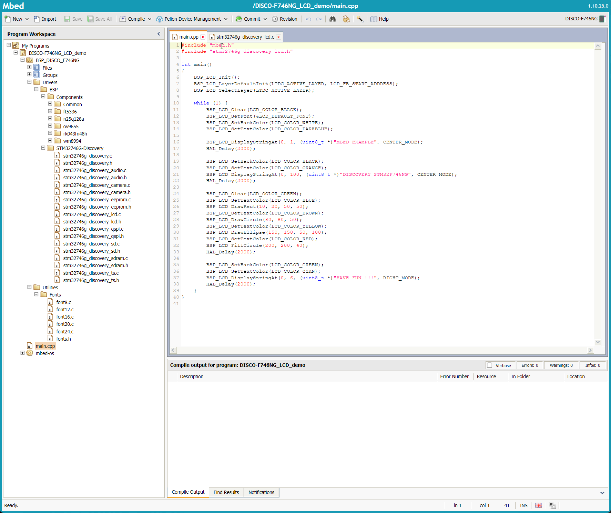

# Lesson 2 Assignments

## Exercise 2.1: Idea Project Diagram

Make a block diagram describing an embedded system you’d like to have or make. Be imaginative. Reality does not apply here.

### *Souse Vide* controller.
User sets teperature and time or choses predefined temperature profile.
Controler turns heat in the rice cooker and tells the French Chef Joke of the day.
It makes announcements about the temperature (reached, temperature swings) 
Camera monitors the area of cooking and sends progress pictures over the internet ...

## Assignment Submission

## Exercise 2.2: Read mbed code, make diagram

* Go to mbed platforms https://os.mbed.com/platforms/
* Select any platform (hint: search for a processor similar to the one you are considering
for your final project)
* Read through the platform page
* Add to Mbed Compiler (button on right)
* Load a simple sounding template
* Create a block diagram for this program, briefly explain why you chose the platform
and template you did, be prepared to talk about this board in Live Class

## Assignment Submission

Selected Platform: DISCO-F746NG ([User Manual](https://www.st.com/resource/en/user_manual/um1907-discovery-kit-for-stm32f7-series-with-stm32f746ng-mcu-stmicroelectronics.pdf))

([mbed link](https://os.mbed.com/platforms/ST-Discovery-F746NG/))

It's 2021/2022.
I chose this platform because it is one of the boards I already have somwhere at home in an unopened box.
It has way too many features, ime to try them out. 
Everyone else can go to mouser.com and ponder about 53 weeks lead time !
[mouser]https://www.mouser.com/ProductDetail/511-STM32F746G-DISCO
