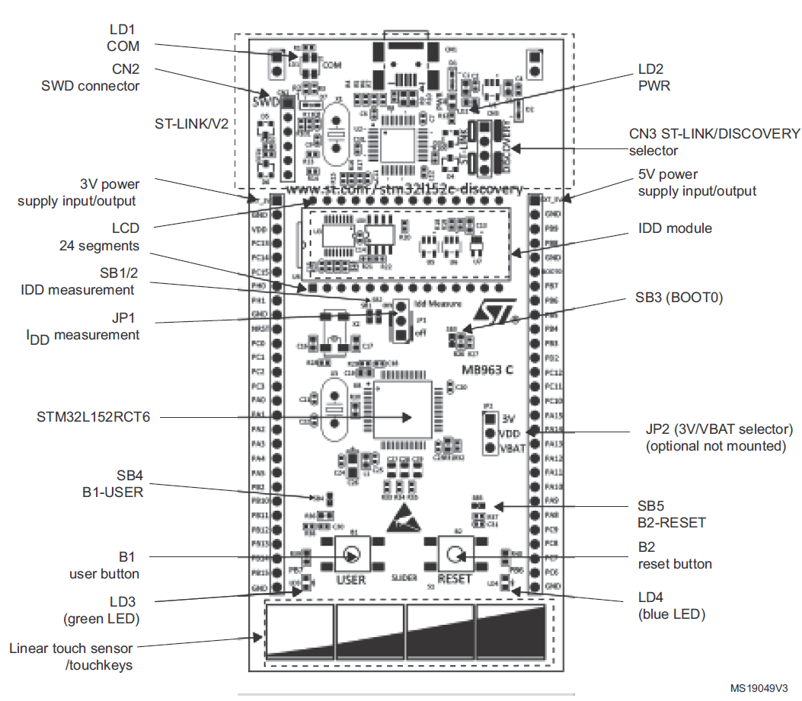
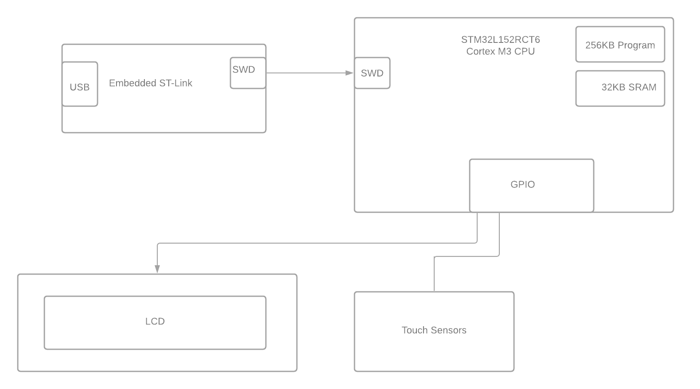
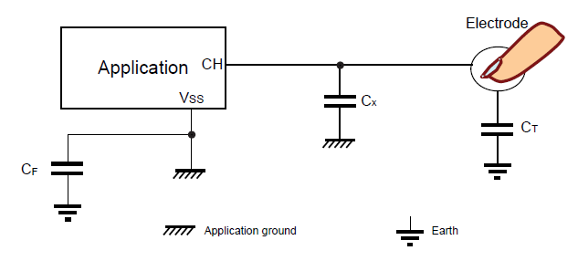

# Exercise 3
## 1. Investigate project board
Look at the documents for the board you are considering for your final project (or any ST Discovery Board), draw the hardware block diagram for the board. For peripherals, note the
communication paths (SPI, I2C, etc).

Look at the datasheet for the processor and other documents. Answer these questions:
 
* **What kind of processor is it?**

  - STM32L-DISCOVERY/newer 32L152CDISCOVERY board has **STM32L152RBT6**/**STM32L152RCT6** CPU which is low power ARM M3 32 bit processor operating at 32 MHz[^1] [^2].
  can turn off Flash and CPU (large consuption contribution) and keep DMA and peripherals working.
  Board is designed to run from a CR2032 standalone battery.

* **How much Flash and RAM does it have? Any other memory types?**

    - 128K/256K bytes of Flash ("medium/+ density device") and 16/32 Kbytes of RAM
    - 4 Kbytes of EEPROM
    - 80 byte backup register as part of the real-time clock

 
* **Does it have any special peripherals? (List 3-5 that you noted as being interesting.)**
  - common peripherals: USB, USART (3x), SPI, I2C (2x), DAC (12 bit), ADC

  - comparators / reference voltage

  - SD multimedia interface
  - capacitive sensing channels (20x)
  - Real Time Clock
  - LCD voltage (step-up) generator

* **Does it have a floating point unit?**
  - There isn't any floating-point hardware in Cortex-M3, but support for C float and double are provided in software by most compilers/libraries.
 
* **If it has an ADC, what are the features?**
  - It has 12-bit ADC, 20 channels
  - sampling time depends on the supply voltage and if its direct or multiplexed input, can be 0.25 to 1us

  **Look at one application note for this processor.**
  [^4] AN3216 explains power supply, clock and boot configuration

  [^5] explains basics of surface sensors

  

[^1]: Discovery kits for STM32L151/152 line Data brief

[^2]: ([cpu docs](https://www.st.com/en/microcontrollers-microprocessors/stm32l152rb.html#documentation))

[^3]: Ultra-low-power 32-bit MCU ARM®-based Cortex®-M3, 128KB Flash, 16KB SRAM, 4KB EEPROM, LCD, USB, ADC, DAC Datasheet

[^4]: AN3216 Getting started with STM32L1xxx hardware development 

[^5]: AN4312 Design with surface sensors for touch sensing applications on MCUs

## 2. SPI Flash Test Code
Unfortunately, the SPI Flash we need to test the Key-Value storage system is on backorder. The
KVStore only uses the read, write, and erase functions from the SPI Flash subsystem. Create a
small simulator so you can test the KVStore. Write a test for your simulator that uses the read,
write and erase functions.
Here is the SPI Flash information.
https://www.digikey.com/en/products/detail/winbond-electronics/W25Q80DVSNIG-TR/5154948

We are going to use ST’s Standard Peripheral Flash Driver so here is the header file for the
code you will need to simulate:
https://drive.google.com/file/d/12dw-pZiKiK1vi4gv49W1x6np5uzCH_cV/view?usp=sharing
Your assignment is to create a small module that compiles and runs on your computer that
implements your flash simulator. You will also need a main file to test out your simulator.
Important notes: You don’t need a full Flash simulator, only what is necessary to test the
KVStore code. You aren’t writing the KVStore code. You do not need to use CPPUTest or other
unit test framework. If you are writing more than 50 lines of code, you are going in the wrong
direction.

[see emulation here](https://github.com/mrszb/spi_flash_simulation)