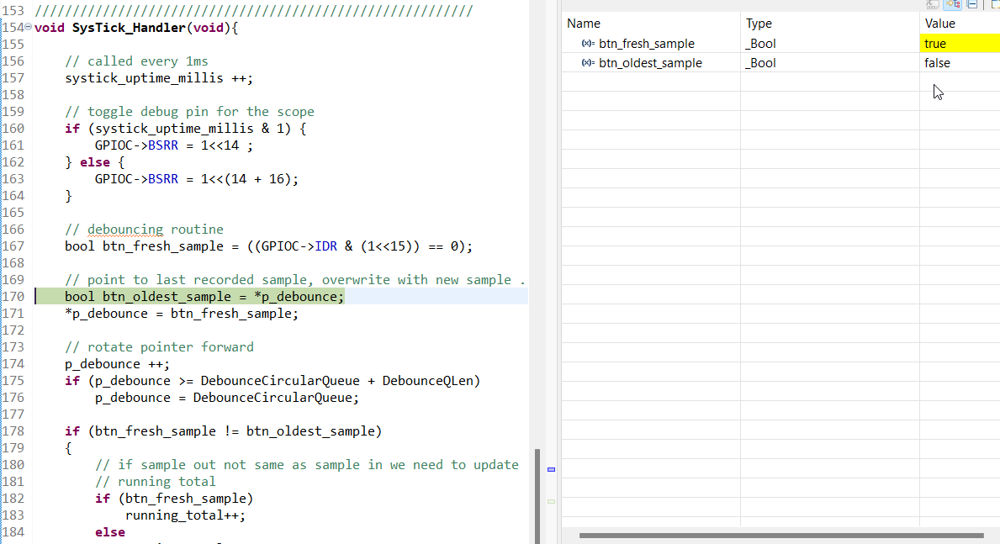

# Exercise 4
On your final project board, make blinky for yourself. Then add a button to turn the LED on and off. Bonus points for making the button cause an interrupt. Triple bonus points for debouncing the button signal.

What are the hardware registers that cause the LED to turn on and off? (From the processor manual, don’t worry about initialization.) What are the button registers that you read? Can you read that memory directly and see the button change in a debugger or by printing out the associated memory?

 

I do not have final board yet but I found "Blue Pill" board and tried my first ARM bare metal programming ...

[->see project repo here<-](https://github.com/mrszb/blue_pill_button_blinky)

# Hardware
Blue Pill - STM32F103C8 board
Button (input) attached between Port/Pin C15 and GND, pulled up by external register
Output Port/Pin C13 has attached external LED (against GND) and internal (against power)
Output Port/Pin C13 .. attached oscilloscope for debugging


# Control Registers
originally I tried to put together memory mapped registers by adding offsets from the manual

```
//#define base_clock 0x40021000
//#define base_gpioc 0x40011000
//
///* clock enable reg */
//#define offset_APB2 0x18
///* port C clock */
//#define IOPCEN (1<<4)
//
//#define offset_GPIOx_CRH 4
//#define offset_GPIOx_ODR 0x0c
//
//uint32_t *apb2 = (uint32_t *) (base_clock + offset_APB2);
//uint32_t *gpioc_h = (uint32_t *) (base_gpioc + offset_GPIOx_CRH);
//uint32_t *gpioc_out = (uint32_t *) (base_gpioc + offset_GPIOx_ODR);

```

but there is better way:

```
#define GPIOC_BASE      (PERIPH_BASE + 0x11000) // GPIOC base address is 0x40011000

typedef struct
{
	uint32_t CRL;      /* GPIO port configuration register low,      Address offset: 0x00 */
	uint32_t CRH;      /* GPIO port configuration register high,     Address offset: 0x04 */
	uint32_t IDR;      /* GPIO port input data register,             Address offset: 0x08 */
	uint32_t ODR;      /* GPIO port output data register,            Address offset: 0x0C */
	uint32_t BSRR;     /* GPIO port bit set/reset register,          Address offset: 0x10 */
	uint32_t BRR;      /* GPIO port bit reset register,              Address offset: 0x14 */
	uint32_t LCKR;     /* GPIO port configuration lock register,     Address offset: 0x18 */
} GPIO_type;
```

in main(void) of the [->main.c<-](https://github.com/mrszb/blue_pill_button_blinky/blob/main/Src/main.c)
first set up Pin 15 as input Pins 13, 14 as output
then init_systick setup interrupt handler to b ecalled every 1ms

I can sample the button state and see in debugger
```
// get latest sample
bool btn_fresh_sample = ((GPIOC->IDR & (1<<15)) == 0);
```



# Debouncing
Button is **sampled in 1ms intervals** (**btn_fresh_sample**) and values are stored in circular queue.

First phase of **low pass filtering** is done by integration - doing **running_total** in the queue.
The implemetation is quite efficient - it requires to bump totla up or down if sample into the queue not same value as oldest sample leaving the circular queue.

Second phase is **hysteresis.**
One need 2/3 of the samples indicating button down to register as button down event (running_total less than queue length/3)
Once button considered pressed ne need 2/3 of the samples in queue indicating button down to register as button down event

```
//////////////////////////////////////////////////////////
// circular queue holds sampled button values
// using running total and 1/3, 2/3 hysteresis to debounce

#define DebounceQLen  18
#define LowerThr (DebounceQLen/3)
#define UpperThr (DebounceQLen/3)*2

volatile bool DebounceCircularQueue[DebounceQLen],
	*p_debounce;
```


```
// debouncing routine
// point to last recorded sample, overwrite with new sample ...
bool btn_oldest_sample = *p_debounce;
*p_debounce = btn_fresh_sample;

// rotate pointer forward
p_debounce ++;
if (p_debounce >= DebounceCircularQueue + DebounceQLen)
    p_debounce = DebounceCircularQueue;

if (btn_fresh_sample != btn_oldest_sample)
{
    // if sample out not same as sample in we need to update
    // running total
    if (btn_fresh_sample)
        running_total++;
    else
        running_total--;
}

if  (button_pressed)
{
    if (running_total < LowerThr)
        button_pressed = false;
        // BTN UP EVENT
}
else
{
    if (running_total > UpperThr)
        button_pressed = true;
        // BTN DOWN EVENT
}

```
