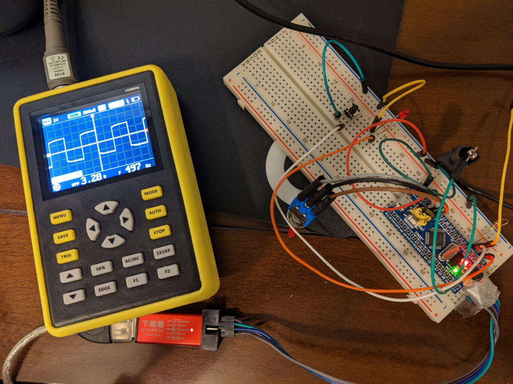

# Exercise 4
On your final project board, make blinky for yourself. Then add a button to turn the LED on and off. Bonus points for making the button cause an interrupt. Triple bonus points for debouncing the button signal.

What are the hardware registers that cause the LED to turn on and off? (From the processor manual, don’t worry about initialization.) What are the button registers that you read? Can you read that memory directly and see the button change in a debugger or by printing out the associated memory?

 

I do not have final board yet but I found "Blue Pill" board and tried my first ARM bare metal programming ...

[->see project repo here<-](https://github.com/mrszb/blue_pill_button_blinky)

