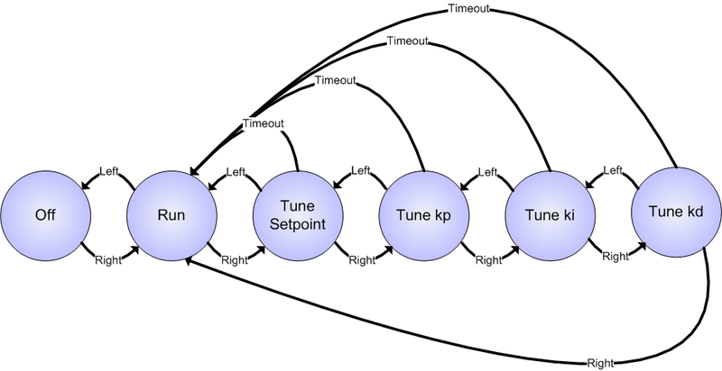

# Souse Vide notes

# Minimal viable project:
[rice cooker](https://www.amazon.com/gp/product/B00197TJ3C/)

controlled by STM32L1 Discovery kit
DS18B20 temp sensor
is PDI control needed ?
maybe hysteresis control possible within few 0.1C since water has huge thermal capacity

have powertail switch to turn on off
[Powertail]
(https://www.adafruit.com/product/268)

sample Arduino implementation is described here
[Adafruit project](https://learn.adafruit.com/sous-vide-powered-by-arduino-the-sous-viduino)

 

- first step port this to STM32L1 board
- Alternative power control  (purchased already)

[Triac]
(https://www.amazon.com/gp/product/B07QZ3K6TQ)

[MOC3041 Integrated bidirectional Driver]
(https://www.amazon.com/gp/product/B08VRMLKNK)

this would enable the kit monitor AC power for zero crossing and switch on/off only some cycles

